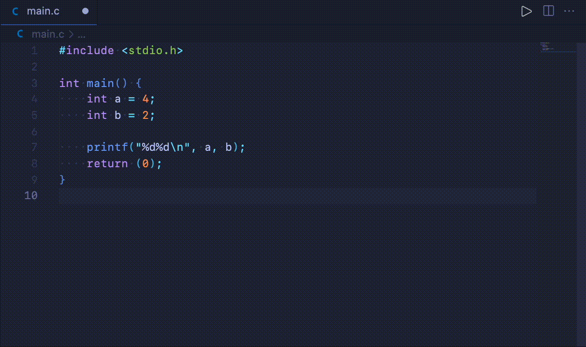

# 42 C-Format

42 C-Format is a VScode formatting provider extension for c_formatter_42, which is a c-language formatter that conforms to Norm v3 in 42 schools.

## Features

Provide document formatting using c_formatter_42.



## Usage

To enable format with 42 C-Format on save, add configuration as below.

```json
{
    "editor.formatOnSave": true,
    "[c]": {
        "editor.defaultFormatter": "keyhr.42-c-format"
    },
}
```

## Requirements

- `c_formatter_42` ([GitHub Repository](https://github.com/cacharle/c_formatter_42))

## Release Notes

### 0.0.1

Initial release.
